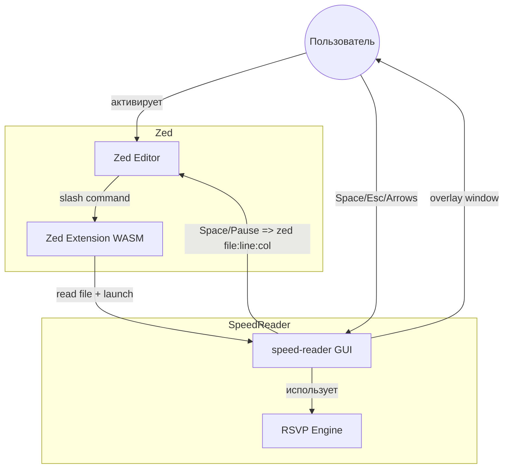
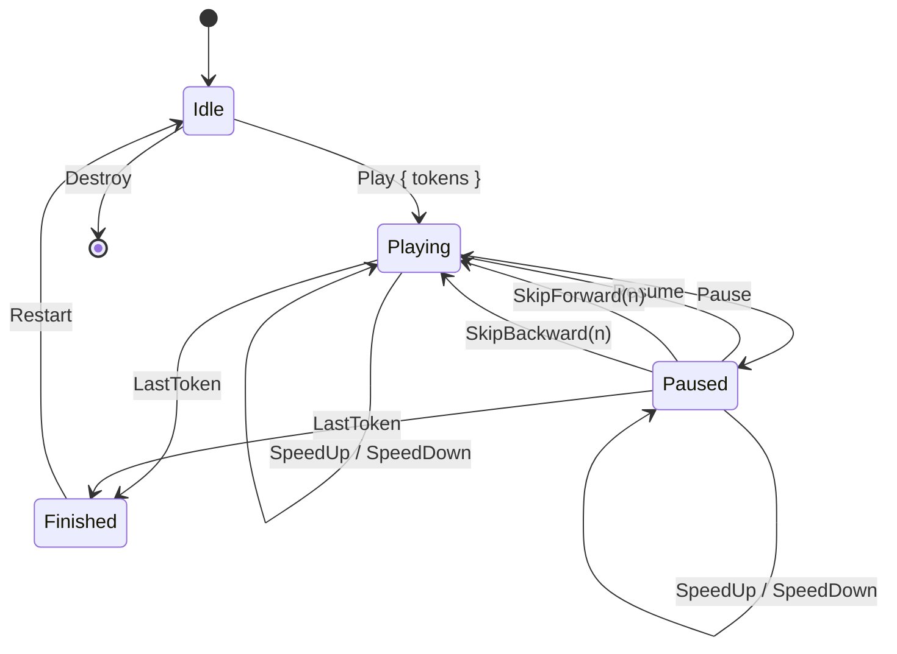

# Technical Design: SpeedReader для Zed

## Overview

Расширение/инструмент для быстрого чтения текста методом RSVP (Rapid Serial Visual Presentation) в экосистеме Zed editor. Система состоит из трёх слоёв: ядро на Rust (RSVP-движок), нативное оверлейное окно для отображения слов, и тонкое расширение Zed для интеграции.

**Ключевое ограничение**: текущее Zed Extension API не поддерживает UI-оверлеи, манипуляцию курсором или чтение активного буфера. Это обуславливает гибридную архитектуру: RSVP-движок и GUI — внешнее приложение, расширение Zed — минимальный мост.

## Goals & Non-Goals

### Goals
- Отображение текста из открытого буфера Zed слово за словом (RSVP) с выделенной центральной буквой (ORP)
- Настраиваемая скорость (WPM) и цветовая схема
- Пауза/возобновление, перемотка вперёд/назад
- При отмене: фиксация позиции чтения для возврата в редактор
- Ядро на Rust, компилируемое в WASM (для будущей совместимости с Zed API)
- Оверлейное окно поверх редактора

### Non-Goals
- Полноценное расширение Zed внутри текущего Extension API (невозможно из-за ограничений API)
- Текстовый процессор или редактор (работает только с готовым текстом)
- TTS (Text-to-Speech) или аудио-чтение
- Облачная синхронизация, профили пользователей
- Мобильная или веб-версия (только desktop)

## Boundary Commitments

### In Boundary
- `speed-reader-core`: токенизация текста, ORP-позиционирование, WPM-тайминг, позиционирование в исходном тексте, конечный автомат чтения
- `speed-reader-gui`: оверлейное окно (winit + skia-safe), рендеринг RSVP, ввод клавиш, запуск `zed <file>:<line>:<col>` для обратной связи с редактором
- `speed-reader-zed`: минимальное расширение Zed для запуска внешнего приложения и передачи контекста

### Out of Boundary
- Редактирование текста (Zed editor)
- Управление файлами/вкладками Zed
- Языковые серверы, отладчики, терминал
- Тематизация Zed (поп-ап имеет собственные темы)
- Доступ к активному буферу (используется путь к файлу + read_text_file)

### Allowed Dependencies
- `speed-reader-core`: только std, `unicode-segmentation`
- `speed-reader-gui`: `winit`, `skia-safe`, `clap` (CLI), `serde` + `serde_json` (config)
- `speed-reader-zed`: `zed_extension_api`, `serde`, `serde_json`

### Revalidation Triggers
- Изменение Zed Extension API, добавляющее UI/overlay/editor manipulation
- Изменение WIT-спецификации (новые методы для расширений)
- Выход gpui как публичного фреймворка (маловероятно)

## Architecture

### High-Level Design

```
+-- Zed Editor -------------------------------------+
|                                                    |
|  +-- Editor Pane --+                              |
|  |                  |  <-- zed file.rs:42:7       |
|  | Open Buffer      |      (CLI jump-to-position) |
|  | Текст/Spec       |                              |
|  |                  |                              |
|  +------------------+                              |
|                                                    |
|  +-- Zed Extension (WASM) -----------------------+ |
|  |  /speed-reader slash command                   | |
|  |  read file -> launch app + path                | |
|  +------------------------------------------------+ |
|                                                    |
+-- System Process ----------------------------------+
|                                                    |
|  +--- speed-reader binary (нативный Rust) --------+ |
|  |  Core: токенизация, ORP, тайминг               | |
|  |  GUI: оверлейное окно, рендеринг, ввод         | |
|  |  Space/Пауза -> exec("zed file:42:7")          | |
|  +------------------------------------------------+ |
|                                                    |
+----------------------------------------------------+
```



### Dependency Direction

```
speed-reader-core <-- speed-reader-gui --> stdin/stdout
       ^                      ^
       |                      |
       |              speed-reader-zed
       |                      |
       |              zed_extension_api
       |
  unicode-segmentation
```

- `speed-reader-core` — атомарный слой, не зависит от GUI, Zed, WASM
- `speed-reader-gui` — зависит от `core`, `winit`, `skia-safe`
- `speed-reader-zed` — зависит от `core` (для WASM), `zed_extension_api`
- Зависимости направлены сверху вниз. Нижние слои не знают о верхних.

### System Flows

#### Основной флоу: запуск SpeedReader из буфера

```mermaid
sequenceDiagram
    actor User
    participant Zed as Zed Editor
    participant Ext as speed-reader-zed
    participant App as speed-reader-gui
    User->>Zed: Выделить текст (опционально)
    User->>Zed: Активировать SpeedReader
    Zed->>Ext: run_slash_command(/speed-reader, args)
    Ext->>Zed: Чтение файла из worktree
    Ext->>App: Запуск с путём к файлу + конфиг
    App-->>User: Оверлейное окно с RSVP
    loop Чтение
        App->>App: Показ слов с ORP
        User->>App: Arrows (перемотка)
        User->>App: Up/Down (скорость)
        User->>App: Space (пауза)
        Note over App: Вычислить позицию:<br/>file.rs:42:7
        App->>App: exec("zed file.rs:42:7")
        App->>Zed: zed CLI -> Zed IPC<br/>открывает файл, ставит курсор
        Zed-->>User: Курсор на слове,<br/>редактор готов к правке
        Note over App: Окно остаётся открытым
        User->>App: Space (продолжить)
        App->>App: Чтение с той же позиции
    end
    User->>App: Esc (отмена)
    App->>App: Завершение процесса без прыжка

#### Состояния чтения

```mermaid
stateDiagram-v2
    [*] --> Idle
    Idle --> Playing: Start
    Playing --> Paused: Space
    Paused --> Playing: Space
    Paused --> Idle: Escape
    Paused --> Paused: Left/Right (skip)
    Playing --> Idle: Escape / EOF
    Idle --> [*]: Close
    note right of Idle
        Приложение запущено,
        текст загружен
    end note
```

## File Structure Plan

| File Path | Responsibility | Status |
|-----------|---------------|--------|
| `Cargo.toml` | Workspace root (core + gui + zed ext) | Create |
| `core/Cargo.toml` | Библиотека RSVP-движка | Create |
| `core/src/lib.rs` | Публичный API библиотеки | Create |
| `core/src/tokenizer.rs` | Токенизация текста + ORP-позиционирование | Create |
| `core/src/timing.rs` | WPM-тайминг, word-length scaling, punctuation pauses | Create |
| `core/src/state.rs` | Конечный автомат чтения (Idle/Playing/Paused) | Create |
| `core/src/position.rs` | Маппинг token_index -> source byte offset | Create |
| `core/src/config.rs` | Модель конфигурации (WPM, тема, шрифт) | Create |
| `gui/Cargo.toml` | Десктопное оверлейное приложение | Create |
| `gui/src/main.rs` | Точка входа: CLI, инициализация окна, IPC | Create |
| `gui/src/overlay.rs` | Прозрачное окно (winit), цикл событий | Create |
| `gui/src/renderer.rs` | Skia-рендеринг: фон, слово, ORP | Create |
| `gui/src/input.rs` | Обработка клавиш (Space, Esc, Arrows, Up/Down) | Create |
| `gui/src/config.rs` | Загрузка/сохранение user config.json | Create |
| `gui/src/ipc.rs` | stdin/stdout протокол с Extension | Create |
| `zed-ext/Cargo.toml` | WASM-расширение Zed (cdylib) | Create |
| `zed-ext/extension.toml` | Манифест расширения Zed | Create |
| `zed-ext/src/lib.rs` | Extension trait + slash command | Create |
| `config.json` | Пример конфига (WPM=300, theme=dark) | Create |

## Components & Interfaces

### Component Summary

| Component | Domain | Intent | Requirements | Dependencies |
|-----------|--------|--------|-------------|--------------|
| Tokenizer | Core | Разбивка текста на токены с ORP-индексами | 1.1, 1.2 | unicode-segmentation |
| TimingEngine | Core | Расчёт времени показа для каждого слова | 4.1 | std |
| ReadingState | Core | Конечный автомат: Playing/Paused/etc | 3.1, 3.2, 3.3 | std |
| PositionTracker | Core | Маппинг токена в исходную позицию | 2.2 | std |
| ConfigModel | Core | Структура конфигурации (WPM, тема, шрифт) | 4.1, 4.2, 4.3 | serde |
| OverlayWindow | GUI | Прозрачное окно поверх редактора | 2.1 | winit |
| RSVPRenderer | GUI | Рендеринг текста с ORP-подсветкой | 1.1 | skia-safe |
| InputHandler | GUI | Клавиатурное управление | 3.1, 3.2, 3.3 | winit |
| ExtSlashCommand | Zed | Slash-команда для запуска SpeedReader | 1.2, 5.2 | zed_extension_api |
| ConfigPersistence | GUI | Загрузка/сохранение настроек | 4.1, 4.2, 4.3 | serde_json |

### Detailed Components

#### speed-reader-core

##### Tokenizer
- **Interface**: `Tokenizer::tokenize(text: &str) -> Vec<Token>`
- **Token struct**: `{ word: String, orp_index: usize, byte_offset: usize, byte_len: usize, is_sentence_end: bool }`
- **ORP formula**: `if len <= 2 { 0 } else { ((len + 1) / 2).min(4) - 1 }` — центральная буква, смещение для длинных слов
- **Segmentation**: `unicode-segmentation` для границ слов + custom для пунктуации
- **Sentence detection**: период + пробел + заглавная; исключения (e.g., Dr., etc.)
- **Errors**: возвращает `Result<Vec<Token>, TokenizeError>` для пустого текста, невалидного UTF-8

##### TimingEngine
- **Interface**: `TimingEngine::new(wpm: u32) -> Self` + `calculate(&Token) -> Duration`
- **Base timing**: `ms = 60_000.0 / wpm * (word.len() as f64 / 5.0).clamp(0.5, 3.0)`
- **Punctuation scaling**: comma=1.5x, period=2.5x, paragraph=4x
- **Output**: `TimedToken { token: Token, display_duration: Duration, pause_after: Duration }`
- **Constraints**: WPM validated 50-1000, минимальное время 30ms

##### ReadingState (State Machine)
- **Interface**:
  - `ReadingState::new(tokens: Vec<TimedToken>) -> Self`
  - `transition(event: Event) -> Result<StateChange, StateError>`
  - `current_token() -> &TimedToken` (текущее слово)
  - `progress() -> Progress` { current, total, percentage }
- **Events**: `Play | Pause | SkipForward(n) | SkipBackward(n) | Stop | SpeedUp(delta) | SpeedDown(delta)`
- **States**: `Idle | Playing { token_index: usize } | Paused { token_index: usize } | Finished`
- **Errors**: `StateError::NoTokens | StateError::OutOfRange | StateError::InvalidTransition`

##### PositionTracker
- **Interface**:
  - `PositionTracker::new(text: &str) -> Self`
  - `position_for_token(token_index: usize) -> SourcePosition`
- **SourcePosition**: `{ byte_offset: usize, line: usize, column: usize, context_line: String }`
- **Builds offset map** при инициализации для O(1) lookup

##### ConfigModel
- **Interface**: `ConfigModel` (Serialize/Deserialize)
- **Fields**:
  ```rust
  struct ConfigModel {
      wpm: u32,                    // default 300
      theme: Theme,                // Light | Dark | Custom
      font_size: f32,              // default 48.0
      font_family: String,         // default system font
      accent_color: String,        // hex, default "#FF4444"
      bg_color: String,            // hex, default "#1A1A1A"
      text_color: String,          // hex, default "#FFFFFF"
      skip_amount: u32,            // default 5 (words)
      speed_step: u32,             // default 10 (WPM per step)
  }
  struct Theme { light: ThemeColors, dark: ThemeColors }
  ```

#### speed-reader-gui

##### OverlayWindow
- **Platform**: `winit` для создания окна
- **Properties**: transparent background, always-on-top, frameless, размер ~600x200
- **Event loop**: winit event loop с `ControlFlow::Poll`, таймером для RSVP
- **Position**: center of screen (по умолчанию), перетаскиваемое (drag)
- **Visibility**: auto-focus при старте, скрывается при потере фокуса (Escape fallback)

##### RSVPRenderer
- **Backend**: `skia-safe` (GPU-ускоренный canvas)
- **Pipeline**:
  1. Clear (прозрачный фон)
  2. Нарисовать фоновый прямоугольник с `bg_color` + corner radius
  3. Нарисовать слово: все буквы `text_color`, центральная `accent_color`
  4. Нарисовать WPM и прогресс в углу
- **Word positioning**: слово центрируется по ORP-букве в фиксированной точке экрана
##### InputHandler
- **Key bindings** (всегда активны при фокусе окна):
  - `Space` — пауза + прыжок в Zed (`zed file:line:col`). Окно stays open.
  - `Space` ещё раз — продолжить чтение с той же позиции.
  - `Esc` — выход, завершить чтение. Окно закрывается, прыжка в Zed нет.
  - `Left` / `Right` — перемотка на N слов
  - `Up` — увеличить WPM на step
  - `Down` — уменьшить WPM на step
  - `R` — перезапуск
- **Zed CLI integration**:
  - При Space (пауза): `PositionTracker.position_for_token(current_index)` -> SourcePosition
  - `std::process::Command::new("zed").arg(format!("{}:{}:{}", file_path, line, column)).spawn()`
  - Zed CLI найдёт работающий процесс и пошлёт IPC -> курсор на позиции
- **File path**: передаётся при запуске через CLI-аргумент или stdin
##### ConfigPersistence
- **Config file path**: `~/.config/speed-reader/config.json`
- **Load on startup**, save on change (speed/theme)
- **CLI flags** переопределяют config: `speed-reader --wpm 500 --theme dark file.txt`
##### IPC Protocol (stdin/stdout)
- Extension передаёт приложению при старте: JSON `{ "file_path": "/abs/path/file.rs", "config": { "wpm": 300 } }`
- По этому пути приложение на паузе/выходе вызывает `zed <file_path>:<line>:<col>`
- Протокол: первый JSON в stdin = конфигурация. Дальше JSON-событий нет (чтение управляется клавишами)
- Приложение пишет в stdout опциональные события (для отладки)

#### speed-reader-zed (Zed Extension)

##### Extension trait
- **Implements**: `zed::Extension`
- **Registers slash command**: `/speed-reader`
- **Command behaviour**:
  1. Принимает путь к файлу из контекста worktree
  2. Читает файл через `worktree.read_text_file()`
  3. Проверяет наличие бинарника `speed-reader` в PATH
  4. Запускает `speed-reader --path <file> --wpm <config>`
  5. Возвращает в Assistant: `"SpeedReader запущен. Закройте приложение для возврата к редактированию."`
- **Future**: если бинарник не найден, показывает инструкцию по установке

##### extension.toml
```toml
id = "speed-reader"
name = "Speed Reader"
version = "0.1.0"
schema_version = 1
authors = ["SpeedReader Team"]
description = "RSVP speed reading for Zed. Requires speed-reader binary."
repository = "https://github.com/user/speed-reader-zed"
[slash_commands.speed-reader]
description = "Launch SpeedReader on current file"
requires_argument = false
```

##### Capabilities
```toml
[capabilities]
process:exec = { kind = "process:exec", command = "speed-reader", args = ["**"] }
```

## Technology Stack

| Layer | Technology | Version | Role |
|-------|-----------|---------|------|
| Core library | Rust | 2024 edition | RSVP engine, pure logic |
| GUI window | winit | 0.30 | Transparent overlay window |
| GUI rendering | skia-safe | 0.78 | GPU text rendering |
| Config serialization | serde + serde_json | 1.x | Configuration persistence |
| CLI argument | clap | 4.x | CLI argument parsing |
| Unicode segmentation | unicode-segmentation | 1.x | Word boundary detection |
| Zed extension | zed_extension_api | 0.7.0 | Zed WASM extension |
| WASM target | wasm32-wasip1 | - | WASM compilation |
| IPC | std (stdio) | - | NDJSON over stdin/stdout |

## Data Models

### Domain Model

```
Token {
    word: String           # само слово, например "reading"
    orp_index: usize       # индекс ORP-буквы, например 2 для "reading"
    byte_offset: usize     # смещение в исходном тексте
    byte_len: usize        # длина в байтах
    is_sentence_end: bool  # true после ".", "!", "?"
}

TimedToken {
    token: Token
    display_duration: Duration  # время показа слова
    pause_after: Duration       # пауза после слова
}

ConfigModel {
    wpm: u32              # 50-1000, default 300
    theme: Theme          # Light | Dark | Custom
    font_size: f32        # default 48.0
    skip_amount: u32      # default 5 слов
    speed_step: u32       # default 10 WPM
    accent_color: String  # hex
    bg_color: String
    text_color: String
}

Progress {
    current: usize        # индекс текущего токена
    total: usize           # всего токенов
    percentage: f32        # 0.0 - 100.0
}

SourcePosition {
    byte_offset: usize    # смещение в байтах
    line: usize           # строка (1-indexed)
    column: usize         # колонка (0-indexed)
    context: String       # строка контекста
}
```

### State Machine



## Testing Strategy

| Test Area | Component | Approach | Requirement |
|-----------|-----------|----------|-------------|
| Tokenization | Tokenizer | Unit: input text → expected tokens/ORP | 1.1 |
| Empty/edge | Tokenizer | Unit: empty string, special chars, long words | 1.1 |
| WPM timing | TimingEngine | Unit: verify ms per word matches formula | 4.1 |
| Punctuation pauses | TimingEngine | Unit: comma/period/paragraph multipliers | 4.1 |
| State transitions | ReadingState | Unit: all valid/invalid transitions | 3.1, 3.2, 3.3 |
| Position mapping | PositionTracker | Unit: text → byte_offset match | 2.2 |
| Serialization | ConfigModel | Unit: JSON round-trip | 4.1, 4.2, 4.3 |
| Config validation | ConfigModel | Unit: WPM out of range, empty theme | 4.1 |
| CLI parsing | GUI | Integration: flag parsing | - |
| Overlay rendering | GUI | Manual visual verification | 2.1 |
| Keyboard handling | GUI | Manual: Space, Esc, Arrows, Up/Down | 3.1, 3.2, 3.3 |
| Buffer/selection input | Zed extension | Integration: slash command on file | 1.2 |
| End-to-end | Full system | E2E: select text -> Space pause -> zed jumps to position -> Space resume | 1.1, 1.2, 2.2, 3.1 |
| zed CLI feedback | GUI | Integration: Space -> zed file:line:col call | 3.1 |

## Requirements Traceability

| Requirement | Summary | Components | Interfaces | Flows |
|-------------|---------|------------|------------|-------|
| 1.1 | RSVP word display with ORP | Tokenizer, RSVPRenderer | tokenize(), render_word() | Main loop |
| 1.2 | Launch from buffer | ExtSlashCommand | run_slash_command() | Main sequence |
| 3.1 | Pause/resume | ReadingState, InputHandler | Space -> pause + zed file:line:col | Sequence diagram |
| 3.2 | Cancel without jump | InputHandler | Esc -> close, no zed call | Sequence diagram |
| 3.3 | Skip forward/back | ReadingState, InputHandler | transition(SkipForward/Back) | State diagram |
| 4.1 | WPM configuration | ConfigModel, TimingEngine | calculate() with WPM | - |
| 4.2 | Color scheme | ConfigModel, RSVPRenderer | render with theme colors | - |
| 4.3 | Font size | ConfigModel, RSVPRenderer | render with font size | - |
| 5.1 | Rust core | speed-reader-core | - | - |
| 5.2 | Zed extension | speed-reader-zed | Extension trait | - |
| 5.3 | Performance | TimingEngine, RSVPRenderer | <16ms jitter | - |

## Security & Performance

### Performance Targets
- **RSVP frame time**: <16ms per word transition (>60fps)
- **Tokenization**: <100ms for 100K chars
- **Memory**: <50MB for typical documents
- **Startup time**: <500ms from command to visible overlay
- **WPM jitter**: <5ms deviation from nominal timing

### Security
- Расширение запускает только бинарник `speed-reader` (проверка через `which`/capabilities)
- Нет сетевых запросов, нет удалённого кода
- Конфиг — локальный файл, никаких токенов/ключей
- Расширение следует capability model Zed (process:exec только для speed-reader)

## Migration & Deployment

### Установка
```
# 1. Установить бинарник speed-reader
cargo install speed-reader

# 2. Установить расширение Zed
# Через Zed: "Install Dev Extension" -> указать путь к zed-ext/
# Или через extensions.toml (после публикации)
```

### Зависимости для сборки
- Rust 2024 edition
- `wasm32-wasip1` target (для расширения Zed)
- Системные библиотеки: skia (или использовать skia-safe с bundled feature)

### Порядок реализации
1. `speed-reader-core` — базовая библиотека (tokenizer, timing, state, position, config)
2. `speed-reader-gui` — оверлейное приложение (window, renderer, input)
3. `speed-reader-zed` — расширение Zed (minimal WASM bridge)
4. Интеграционное тестирование, CLI polish

## Open Questions / Risks

| Вопрос/Риск | Статус | Влияние |
|-------------|--------|---------|
| Zed может добавить UI Panel API в будущем | Monitoring | Снизит необходимость во внешнем GUI |
| Как получать выделенный текст (не весь файл)? | Open | Через pipe/socket или передачу выделения |
| GPU-рендеринг skia-safe на всех платформах | TBD | fallback: software-рендеринг |
| Совместимость winit с Zed fullscreen режимом | Open | Тестировать на macOS, Linux, Windows |
| Реакция пользователей на RSVP (утомляемость) | Known | Исследования показывают 12% снижение понимания |
| Лицензия проекта | MIT | Выбрать MIT для максимальной совместимости |
